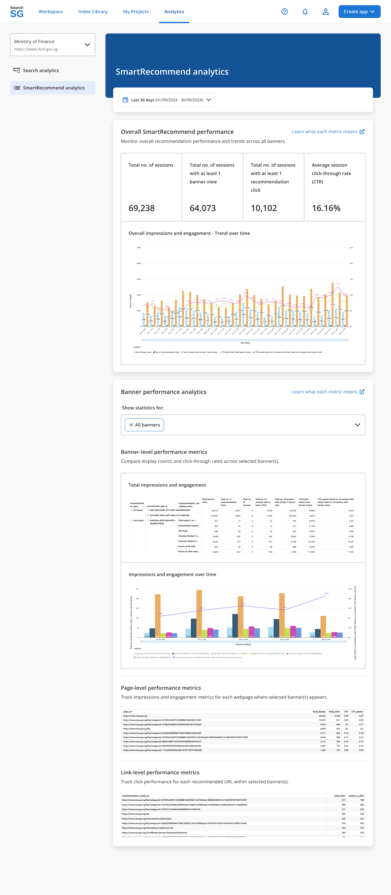

## Search Bar Analytics

### How to access the search bar analytics?

1. Login to the Admin Portal.

2. Under `Analytics`, select the site in the site selection dropdown and click on `Search usage`, `Query insights` or `Search result insights`.
    - The site selection dropdown prioritizes the sites where you are the `owner` or `editor` and groups them under `My sites` at the top.
    - The other production sites are grouped under `All sites` in alphabetical order.

3. By default, analytics data displayed will be for the last 30 days. You can make use of the date range filter to look for analytics within a specific date range.
   

### Search Analytics Metrics

The following key search analytics metrics are tracked and displayed to provide insights into search performance and user behavior on your site:

1. **Search Volume**
    - Definition: The total number of search transactions conducted on your site.
    - Purpose: Indicates the overall usage of the search functionality.

2. **Click-through Rate (CTR)**
    - Definition: The percentage of search sessions where users clicked on a search result after performing a search.
    - Purpose: Measures the relevance of search results to users' queries. A higher CTR indicates better performance.

3. **Average Search Results Position Clicked (Mean Reciprocal Rank - MRR)**
    - Definition: The average rank position of search results clicked by users on the search results page.
    - Purpose: Assesses how accurately the search engine ranks relevant results. A lower rank value indicates better accuracy.

4. **Top Queries with Highest Click-through Rate**
    - Definition: Search queries with the best performance in terms of CTR.
    - Purpose: Highlights topics and content keywords that users find most engaging and accessible.

5. **Top Queries with No Click-through**
    - Definition: Search queries that did not result in any clicks on search results.
    - Purpose: Identifies content topics users are interested in but are unable to locate effectively. These queries represent opportunities for improvement in content quality, structure, or discoverability. You can considering leveraging featured results feature to pin specific useful webpage for the top queries identified here to improve search experience.

## SmartAnswer Analytics

### How to access the SmartAnswer analytics?

1. Login to the Admin Portal.

2. Under `Analytics`, select the site in the site selection dropdown and click on `SmartAnswer insights`.

3. By default, analytics data displayed will be for the last 30 days. You can make use of the date range filter to look for analytics within a specific date range.
   

### SmartAnswer Analytics Metrics

1. **Total no. of SmartAnswers generated**
    - Definition: The cumulative count of SmartAnswers provided by SearchSG over a specified period.
    - Purpose: Indicates the SmartAnswer's usage and adoption.

2. **Engagement Rate**
    - Definition: The percentage of SmartAnswers that result in user engagement when users click 'Show more'.
    - Purpose: Measures how effectively your SmartAnswers capture user attention. A higher rate indicates strong relevance and usefulness.

3. **Total Engagement (Clicked on 'Show more')**
    - Definition: The total number of times users click the 'Show More' option for SmartAnswers.
    - Purpose: Shows user interest and indicates how compelling SmartAnswers are. A higher count suggests the content is relevant enough for users to seek additional details.

4. **Usage Rating (Positive Rating / Total Rating)**
    - Definition: The ratio of positive ratings (thumbs up) to the total ratings received for SmartAnswers.
    - Purpose: Indicates how satisfied users are with the accuracy and helpfulness of the SmartAnswers.

5. **Click-through Rate (to source)**
    - Definition: The percentage of users who click on citations within the SmartAnswers out of the total number of users who viewed the SmartAnswers.
    - Purpose: Evaluates user trust and interest in the sources provided by SmartAnswers.

6. **Searches with no SmartAnswers generated**
    - Definition: The percentage of search queries that did not successfully generate a SmartAnswer.
    - Purpose: Identifies whether SmartAnswers was able to effectively find and generate answers for user queries. Highlights potential coverage gaps in your content or indexing. A higher percentage means more missed opportunities to answer user queries directly.

7. **Top search queries with no SmartAnswers**
    - Definition: These are the search terms that currently do not yield a SmartAnswer result.
    - Purpose: Identifies exact user queries for which new or revised content may be needed to address their needs.

## SmartRecommend Analytics

### How to access the SmartRecommend analytics

1. Login to the Admin Portal.
2. Under `Analytics`, select the site in the site selection dropdown and click on `SmartRecommend analytics`. **Note**: `SmartRecommend analytics` are available to sites with an active SmartRecommend banner.
3. By default, analytics data displayed will be for the last 30 days. You can make use of the date range filter to look for analytics within a specific date range.

### SmartRecommend Analytics Metrics

1. **Total no. of sessions**
    - Definition: The total number of sessions where the SmartRecommend banner is loaded.
    - Purpose: Measures how many web sessions include the SmartRecommend banner.

2. **No. of banner views**
    - Definition: The number of instances where a loaded SmartRecommend banner enters the user’s viewport in the browser.
    - Purpose: Measures how many users see the SmartRecommend banner while using your website. This reflects how visible or discoverable the banner placement is on the page to your users.

3. **No of recommendation clicks**
    - Definition: The number of users click on recommended links within the SmartRecommend banner.
    - Purpose: Measures direct user engagement with recommendations shown.

4. **Total no. of sessions with at least 1 banner view**
    - Definition: The number of sessions where at least 1 SmartRecommend banner enters the visitor's viewport.
    - Purpose: Measures how many sessions include at least 1 visible recommendation banner. This reflects how visible or discoverable the banner placement is on the page to your users.

5. **Total no. of sessions with at least 1 recommendation click**
    - Definition: The number of recommend sessions where the user clicks at least 1 recommended link.
    - Purpose: Measures how many sessions have successful click-through interactions with recommendation links shown.

6. **Average session click-through rate (CTR) (Total clicks / Total banner views)**
    - Definition: The percentage of recommendation clicks out of total banner views.
    - Purpose: Measures how well recommended links match user intent.

7. **Click-through rate (CTR) Session (Total no. of sessions with clicks / total no. of sessions with banner view)**
    - Definition: The percentage of user sessions where at least 1 recommendation was clicked out of all sessions where recommendations were visible.
    - Purpose: Measures how many recommendation sessions have click-through on at least 1 recommendations shown. Indicates relevance and usefulness of recommendations displayed.

8. **Overall impressions and engagement - Trend over time**
    - Definition: Tracking of banner views, clicks, and CTR across all banners.
    - Purpose: Monitors overall recommendation performance and trends across all banners.

9. **Banner-level performance analytics**
    - Definition: Performance metrics (displays, clicks, CTR) segmented by individual SmartRecommend banners.
    - Purpose: Compares display counts and click-through rates across selected banner(s).

10. **Page-level performance metrics**
    - Definition: Performance metrics (displays, clicks, and CTR) segmented by individual webpage.
    - Purpose: Tracks impressions and engagement metrics for each webpage where selected banner(s) appears.

11. **Link-level performance metrics**
    - Definition: Clicks segmented for each recommended URL within selected banners.
    - Purpose: Tracks click performance for each recommended URL within selected banner(s).