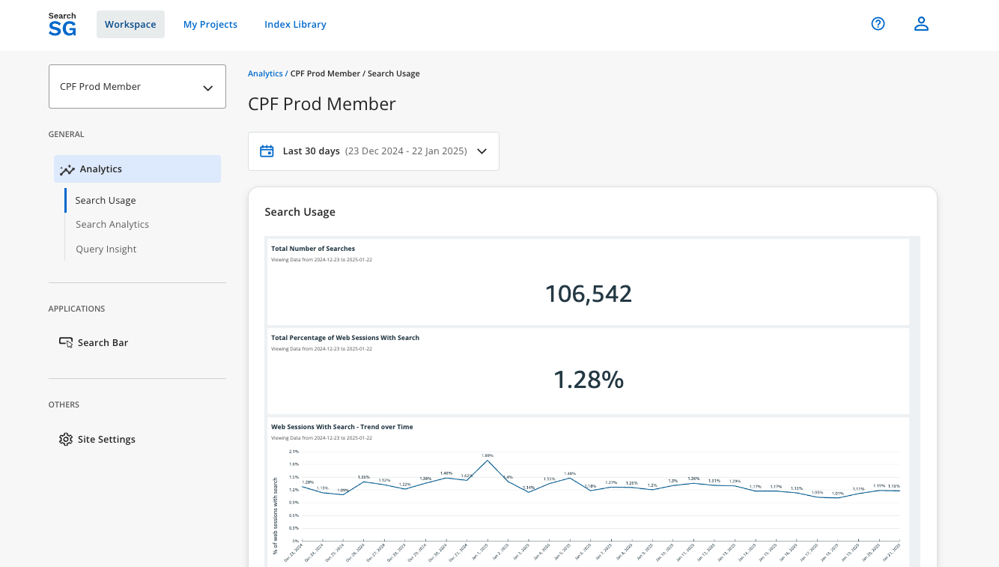

## Search Engine Analytics

### How to access the search engine analytics?
1. Login to the Admin Portal.

2. Under `Workspace`, select the site in the site drop-down list and click on the `Analytics` tabs - `Search Usage`, `Search Analytics` or `Query Insight`. 

3. By default, analytics data displayed will be for the last 30 days. You can make use of the date range filter to look for analytics within a specific date range.

### Search Analytics Metrics
The following key search analytics metrics are tracked and displayed to provide insights into search performance and user behavior on your site:

1. **Search Volume**
    - Definition: The total number of search transactions conducted on your site.
    - Purpose: Indicates the overall usage of the search functionality.

2. **Click-through Rate (CTR)**
    - Definition: The percentage of search sessions where users clicked on a search result after performing a search.
    - Purpose: Measures the relevance of search results to users' queries. A higher CTR indicates better performance.

3. **Average Search Results Position Clicked (Mean Reciprocal Rank - MRR)**
    - Definition: The average rank position of search results clicked by users on the search results page.
    - Purpose: Assesses how accurately the search engine ranks relevant results. A lower rank value indicates better accuracy.

4. **Top Queries with Highest Click-through Rate**
    - Definition: Search queries with the best performance in terms of CTR.
    - Purpose: Highlights topics and content keywords that users find most engaging and accessible.
    
5. **Top Queries with No Click-through**
    - Definition: Search queries that did not result in any clicks on search results.
    - Purpose: Identifies content topics users are interested in but are unable to locate effectively. These queries represent opportunities for improvement in content quality, structure, or discoverability. You can considering leveraging featured results feature to pin specific useful webpage for the top queries identified here to improve search experience.