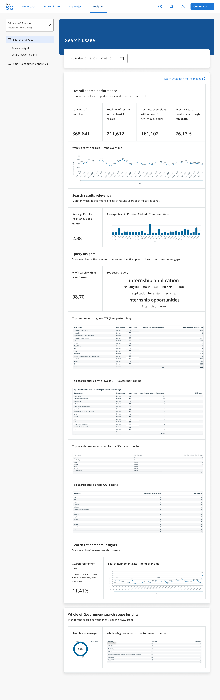
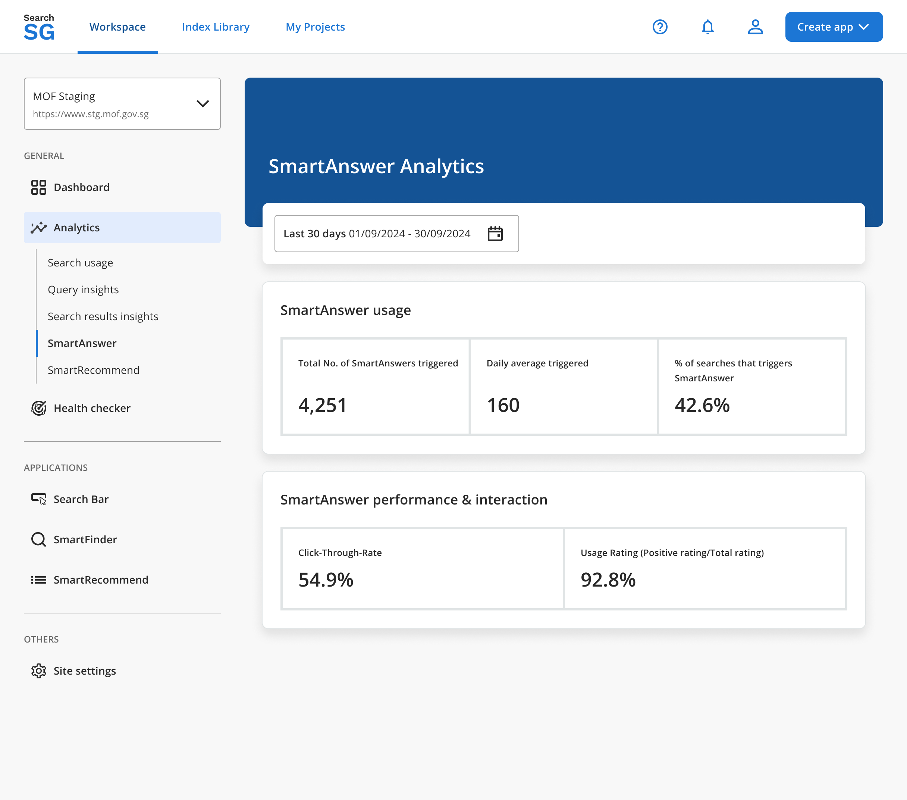

## Search Bar Analytics

### How to access the search bar analytics?

1. Login to the Admin Portal.

2. Under `Workspace`, select the site in the site drop-down list and click on the `Analytics` tabs - `Search Usage`, `Search Analytics` or `Query Insight`.

3. By default, analytics data displayed will be for the last 30 days. You can make use of the date range filter to look for analytics within a specific date range.
   

### Search Analytics Metrics

The following key search analytics metrics are tracked and displayed to provide insights into search performance and user behavior on your site:

1. **Search Volume**
    - Definition: The total number of search transactions conducted on your site.
    - Purpose: Indicates the overall usage of the search functionality.

2. **Click-through Rate (CTR)**
    - Definition: The percentage of search sessions where users clicked on a search result after performing a search.
    - Purpose: Measures the relevance of search results to users' queries. A higher CTR indicates better performance.

3. **Average Search Results Position Clicked (Mean Reciprocal Rank - MRR)**
    - Definition: The average rank position of search results clicked by users on the search results page.
    - Purpose: Assesses how accurately the search engine ranks relevant results. A lower rank value indicates better accuracy.

4. **Top Queries with Highest Click-through Rate**
    - Definition: Search queries with the best performance in terms of CTR.
    - Purpose: Highlights topics and content keywords that users find most engaging and accessible.

5. **Top Queries with No Click-through**
    - Definition: Search queries that did not result in any clicks on search results.
    - Purpose: Identifies content topics users are interested in but are unable to locate effectively. These queries represent opportunities for improvement in content quality, structure, or discoverability. You can considering leveraging featured results feature to pin specific useful webpage for the top queries identified here to improve search experience.

## SmartAnswer Analytics

### How to access the SmartAnswer analytics?

1. Login to the Admin Portal.

2. Under `Workspace`, select the site in the site drop-down list and click on the `Analytics` then `SmartAnswer`.

3. By default, analytics data displayed will be for the last 30 days. You can make use of the date range filter to look for analytics within a specific date range.
   

### SmartAnswer Analytics Metrics

1. **Total No. of SmartAnswers Triggered**
    - Definition: The cumulative count of SmartAnswers provided by SearchSG over a specified period.
    - Purpose: Indicates the SmartAnswer's usage and adoption.

2. **Total Engagement (Clicked on 'Show more')**
    - Definition: The total number of times users click the 'Show More' option for SmartAnswers.
    - Purpose: Shows user interest and indicates how compelling SmartAnswers are. A higher count suggests the content is relevant enough for users to seek additional details.

3. **Engagement Rate (Engagement/Total SmartAnswers triggered)**
    - Definition: The percentage of SmartAnswers that result in user engagement when users click 'Show more'.
    - Purpose: Measures how effectively your SmartAnswers capture user attention. A higher rate indicates strong relevance and usefulness.

4. **Click-through Rate (to source)**
    - Definition: The percentage of users who click on citations within the SmartAnswers out of the total number of users who viewed the SmartAnswers.
    - Purpose: Evaluates user trust and interest in the sources provided by SmartAnswers.

4. **Usage Rating (Positive Rating / Total Rating)**
    - Definition: The ratio of positive ratings (thumbs up) to the total ratings received for SmartAnswers.
    - Purpose: Indicates how satisfied users are with the accuracy and helpfulness of the SmartAnswers.

5. **Search Query Percentage with no SmartAnswers**
    - Definition: The percentage of search queries that did not successfully generate a SmartAnswer.
    - Purpose: Identifies whether SmartAnswers was able to effectively find and generate answers for user queries. Highlights potential coverage gaps in your content or indexing. A higher percentage means more missed opportunities to answer user queries directly.

6. **Search Terms with no SmartAnswers**
    - Definition: These are the search terms that currently do not yield a SmartAnswer result.
    - Purpose: Identifies exact user queries for which new or revised content may be needed to address their needs.

