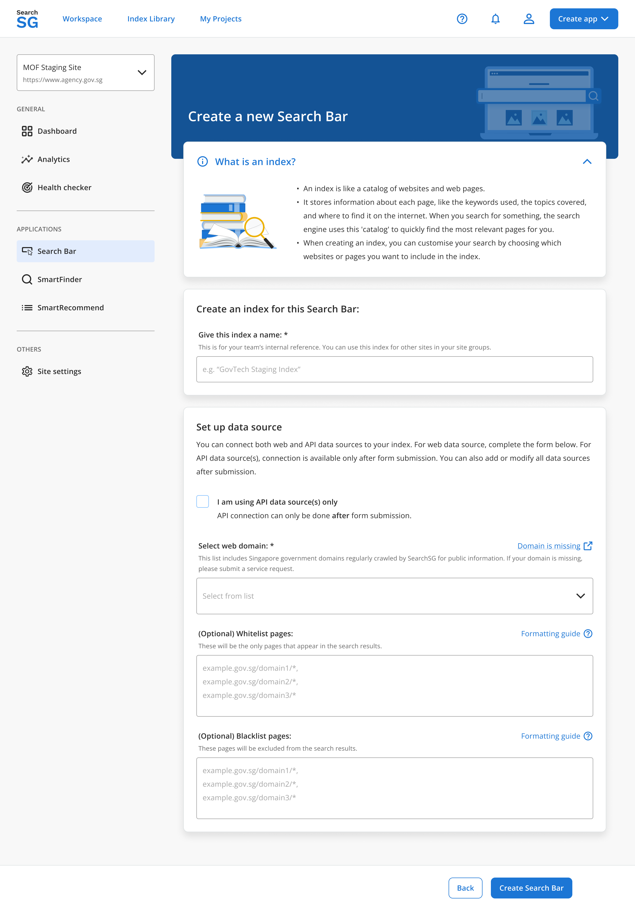

## Application

- A `Site` refers to a website or server-side application that integrates with SearchSG. 
- It serves as a workspace for multiple applications, such as Search and Recommend, requiring only a one-time integration to enable the use of multiple application features.
- An `Application` encapsulates all configurations for a specific search / recommend feature deployed on your site. E.g. search bar settings and filter configurations for your search app are managed under 'Applications'. 
- The creation of a `Site`is seamlessly integrated into the `Create Application` flow, allowing it to be developed in parallel with the `Application` for a unified and efficient process.

## Search Bar Application
### How to create a Search Bar Application?
1. Login to Admin Portal.

2. Click on "Create app" then "Search Bar".

3. Choose the site you would like to host the search bar then click next. 

   - If you would like to host the search bar on your existing site, select the site from the drop-down list

   - If you would like to host the search bar on a new site, select the option "Create a new site" and enter the information such as name, URL and choose the environment
   

   - If you would like to add the new site into your existing project, select the project from the drop-down list

   - If you would like to add the new site into a new project, select the option "Create a new project" and enter the project name and choose the agency 
   

4. Set up index and click "Next"
   - If you would like to choose the existing from your index library, select the index from the drop-down list
   
   - If you would like to create a new index, select the option "Create a new index" and enter the index name and website to include in the index. Whitelist and blacklist domains are optional. 
   

5. Add code snippet and click on "Complete setup"
   - After completing the setup, you will be shown a unique `client ID` for your application. Follow the integration guide to complete the integration with your website.
   
   

6. Click on "View Search Bar settings" to access the application setup page. The application status will initially show as "Inactive" and will change to "Active" once the integration is complete on your website.

### Configuring your Search Bar
Once your search Bar application is created, you can customise your search application under `Applications > Search Bar` section in the side menu.

#### Basic Setup
1. Search Bar Placement
    - Enter the HTML Id of the container div element where you would like the search bar component to be rendered on your website.
    - Follow the onboarding guide on how to [add the searchbar widget to your website](https://docs.developer.tech.gov.sg/docs/searchsg-onboarding-guide/getting-started?id=step-2-adding-searchbar-widget-to-your-site).

2. Search Results Page Integration
    - Control whether you would like the search results page to be embedded within your website or redirected to a standalone search results page hosted on search.gov.sg domain.
    - If you have chosen to embed the search results `within your own website`, follow the onboarding guide on how to [embed the search results page within your website search page.](https://docs.developer.tech.gov.sg/docs/searchsg-onboarding-guide/customisation-embed?id=embedded-search-results-page-experience)

#### Advanced Setup
Follow the index guide on how to [create, configure and delete a Search index](/index)

#### UI Customization
1. Search bar features
   - Placeholder text: Customise the text displayed in the search bar before a user types.

   - Quick links: Control whether you want to show suggested pages when you activate the search bar.

   - Search suggestions: Select the type of search suggestions you want to provide users
      - Suggested keywords: Popular queries similar to the user’s search terms. Ranked by keyword frequency and click-through rate.
      - Suggested results: Top pages that match the user’s search terms. Ranked by page views and click-through rate.

   - “Try the improved search” call-out: Choose to show or hide this call-out on the search bar. 
      - Show call-out: Highlight the search bar as a new feature to encourage visitors to use it
      - Hide call-out: Let the new search bar blend in like an existing feature

2. Results page features
   - Whole-of-Government search scope: 
      - Enable: Give users the option to search across all government websites for more comprehensive results.
      - Disable: Limit search within your site. All results shown will only be from your site.

   - Default search results sorting order: 
      - Sort by Relevance: Sort results based on relevance, based on results that best match the search terms.
      - Sort by Date: Most recently updated results appear first.

   - Search result item: Select the details such as `Content type tag`, `'Jump to section' links` and `Topic tag` you would like to show in your search result items.

3. Colours & Fonts
   - Main colours: Set the default colours that will be applied on your search bar.

   - Brand font: Set the fonts used across the search bar and search results page.

4. Filter settings
   - Filter display - Content type: Adjust how filter labels appear and choose which filters to hide or show based on your preferences. 
   The content type filter lets visitors refine search results by selecting the specific content type they are looking for (e.g., eServices, Advisories, Contact Information), ensuring more relevant search outcomes.
      - Top placement display: Display filter group at the top of the search results screen
      - Side placement display: Display filter group on the side of the search results screen. Set the display label below

   - Filter display - Category filter: Adjust how filter labels appear and choose which filters to hide or show based on your preferences.  
   The category type filter allows visitors to narrow down search results by selecting specific topics or themes they are looking for (e.g., Schemes, Parenting, Marriage), ensuring more targeted and relevant search outcomes.
      - Category filter display: Display filter group on the side of the search results screen.

   - Breakpoint Settings
      - Screen size adjustments: Define how your search bar appears on different screen sizes. This ensures that your search bar is user-friendly and visually appealing on all devices.
         - Use SearchSG's predefined defaults: Select this option to use our recommended set of breakpoints
         - Custom breakpoints: Define your own breakpoints for a more tailored responsive design

#### Search Filter & Result Item Customisation
  - Filter configuration preferences: Manage how your website's content is categorised to configure filters for the search results page.
      - Automated (Recommended): SearchSG uses Machine Learning to automatically tag your website's content based on predefined labels for content types and topics. This tagging system organises pages into two distinct filter groups (Content types; Topics) on the search results page.
      - Manual: Define your own content types and topics by manually labelling each page. [Follow the guide to manually tagging your pages.](https://docs.developer.tech.gov.sg/docs/searchsg-onboarding-guide/customisation-search-filter?id=search-filter-amp-result-item-customisation)

   - Additional keyword filters (optional): Adjust how filter labels appear and choose which filters to hide or show based on your preferences.  
   The keywords filter allows visitors to narrow down search results by selecting specific keywords they are looking for (e.g., Baby bonus, Housing grant), ensuring more targeted and relevant search outcomes.

   - Additional custom filters (optional): You can define up to 5 additional categories to better organise your website's content. These custom categories can then be used to display up to 5 additional filter groups, which visitors can use to refine their search results on your search results page. [Follow the guide to setting up custom filters](https://docs.developer.tech.gov.sg/docs/searchsg-onboarding-guide/customisation-search-filter?id=search-filter-amp-result-item-customisation)

#### SmartAnswer
- SmartAnswer leverages Large Language Models (LLMs) to deliver personalised answers to your queries. Drawing from credible sources within SearchSG's search results, it provides accurate and directly relevant information, saving users' time compared to traditional search methods.
- Note: SmartAnswer is powered by Generative AI, a type of artificial intelligence technology.
- To configure SmartAnswer, go to `Workspace > Applications > Search Bar > Results page features > SmartAnswer`.
    - Enable: Displays an AI-generated summary using the top 10 search results for the query, placed above the regular search results. This summary relies solely on your indexed data and includes citations to the original sources.
    - Disable: Show only standard search results without the AI-generated summary.

### How to disable a Search Bar?
1. Login to Admin Portal

2. Navigate to "Workspace" and select your site from the drop-down list

3. Click on "Search Bar" then "Basic setup"

4. Click on switch icon to disable the Search bar 

5. Enter "DISABLE" in the pop-up window then click on "Disable Search bar". Note: "disable" is case-insensitive.

6. Search bar will be disabled

### How to enable a Search Bar?
1. Login to Admin Portal 

2. Navigate to "Workspace" and select your site from the drop-down list

3. Click on "Search Bar" then "Basic setup"

4. Click on "Enable Search bar" in the pop-up window

5. Search bar will be enabled if it's tied to an index

   - When enabling a Search bar with missing index 
      - Click on "connect an index"
      

      - You will be brought to the page to select index to use for the Search bar
      

      - After selecing the index, you will be brought to the "Index Overview" page to review or make amendments on the index if needed
      

      - If you would like to create a new index, click on "Create an index in the Index Library" and you will be brought to "Index Library"
      

      - After selecting the index, follow steps 3 to 5 to enable the Search bar