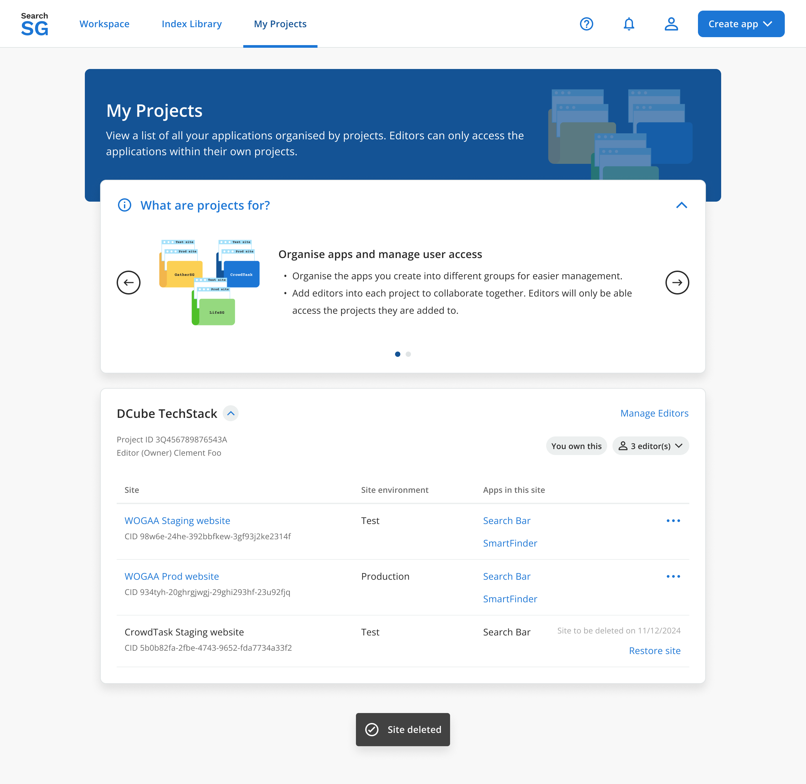

## Application

- A `Site` refers to a website or server-side application that integrates with SearchSG. 
- It serves as a workspace for multiple applications, such as Search and Recommend, requiring only a one-time integration to enable the use of multiple application features.
- An `Application` encapsulates all configurations for a specific search / recommend feature deployed on your site. E.g. search bar settings and filter configurations for your search app are managed under 'Applications'. 
- The creation of a `Site`is now seamlessly integrated into the `Create Application` flow, allowing it to be developed in parallel with the `Application` for a unified and efficient process.

## Site
### How to create a site?
- A `Site` is created seamlessly during the `Create Application` flow to configure where and how your search and recommend applications will be deployed.

### How to edit site settings?
1. Login to Admin Portal

2. Navigate to "Workspace" and select your site from the drop-down list

3. Click on "Site Settings", you will be brought to the "Site Settings Overview" page

4. Click on "Edit site settings", you will be brought to the "Edit site settings" page

5. Click on "Save" after making changes. 

### How to delete a site?
Note: A site can only be deleted when all search and recommend applications within the site has been disabled.

1. Login to Admin Portal

2. Navigate to "My Projects"

3. Click on the  icon then "Delete site"

4. Click on "Delete" in the pop-up window

5. The site will be deleted if it has no application

   - For site that has active application(s), you are unable to delete. 
   

   - For site that has disabled application(s), the site will only be soft-deleted (disabled) and you will have 30 days to restore it if needed. Note: An email notification will be sent to editor(s) 3 days prior to the site being permanently deleted.
   

### How to restore a site?
- Only the site is soft-deleted (disabled), and you have a 30-day window to restore it before it is permanently deleted.

1. Login to Admin Portal

2. Navigate to "My Projects"

3. Click on "Restore site" 

4. Click on "Restore"

5. The site will be restored
