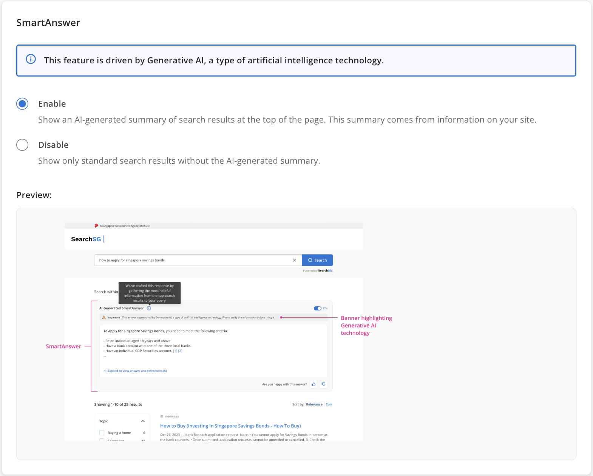
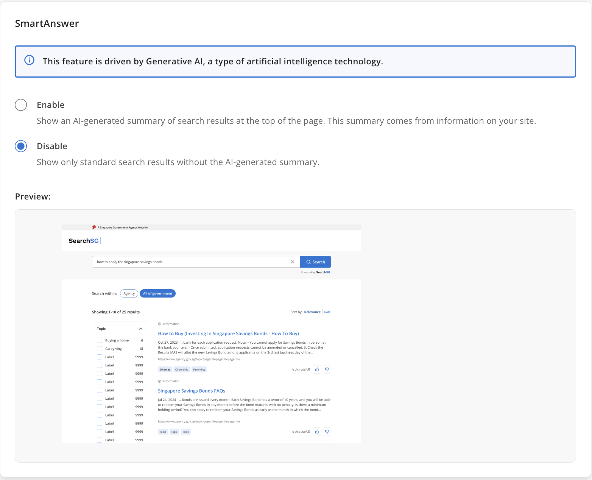

### SmartAnswer
- SmartAnswer leverages Large Language Models (LLMs) to deliver personalised answers to your search queries. Drawing from credible sources within SearchSG's search results, it provides accurate and directly relevant information, saving users' time compared to traditional search methods.
- Note: SmartAnswer is powered by Generative AI, a type of artificial intelligence technology. When enabled, an AI-generated answer using the top 10 search results for the query, will be displayed above the regular search results. This summary relies solely on your indexed data and includes citations to the original sources.
-  [Click here to explore and try out the feature!](https://www.search.gov.sg/results?q=how+to+apply+for+work+permit&scope=wog&cid=926ff4fd-b444-4eb6-8051-caaf3133abcb)

- To enable `SmartAnswer`, you will first need to integrate a `Search Bar` (powered by SearchSG) into your website.
- Once the `SmartAnswer` feature is enabled, an AI-generated summary of search results will appear at the top of the page.

#### How to enable the SmartAnswer feature?
1. Login to Admin Portal.

2. Choose the site you would like to enable the SmartAnswer feature.

3. Click "Search Bar" then "Result page features"

4. Scroll down to find the "SmartAnswer" card, click "Enable", and then save your changes
   

5. The SmartAnswer feature will be enabled for your Search Bar application. 

#### How to disable the SmartAnswer feature?
1. Login to Admin Portal.

2. Choose the site you would like to disable the SmartAnswer feature

3. Click "Search Bar" then "Result page features"

4. Scroll down to find the "SmartAnswer" card, click "Disable", and then save your changes
   

5. The SmartAnswer feature will be disabled for your Search Bar application
- To configure SmartAnswer, go to `Workspace > Applications > Search Bar > Results page features > SmartAnswer`.
    - Enable: Displays an AI-generated summary using the top 10 search results for the query, placed above the regular search results. This summary relies solely on your indexed data and includes citations to the original sources.
    - Disable: Show only standard search results without the AI-generated summary.