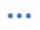

## SmartRecommend

### How to create a Rule-based recommendation banner?

1. Login to Admin Portal.

2. Click on “Create app” then “SmartRecommend”.
    

3. Choose the site you would like to place the banner then click next.
    
    - If you would like to place the banner on your existing site, select the site from the drop-down list
    - If you would like to place the banner on a new site, select the option “Create a new site” and enter the information such as name, URL and choose the environment

    
    - If you would like to add the new site into your existing project, select the project from the drop-down list
    - If you would like to add the new site into a new project, select the option “Create a new project” and enter the project name and choose the agency

    

4. Configure the basic settings then click next. **Note**: These settings can’t be edited after the banner is created.
    
    
    - **Banner Name**: Used for analytics and usage tracking. Once set, it can’t be changed to avoid splitting analytics data.
    - **SmartRecommend Modal**: Select the option "Set my own rule".
    - **Audience Control Settings**: Choose one of the following tracking options (applies to all rules in this banner):
        - Track only the most recent page viewed
        - Track all pages viewed in the past 6 months
    - **Banner Layout**: Select one layout (styling can be adjusted later, but the layout can’t be changed):
        - Link Banner (supports up to 6 links)
        - Horizontally-Stacked Card Banner (supports up to 4 cards)
        - Vertically-Stacked Card Banner (supports up to 4 cards)

5. Define your audience targeting rules then click next.
    
    
    - **Rule Name**: Used in analytics to track usage. **Note**: Once created, the rule name can’t be edited to prevent splitting analytics data.
    - **Rule Activation Period**: Choose when the rule should be active:
        - Always Active – The rule remains active as long as the banner is enabled.
        - Custom Date Range – Specify start and end dates for the rule’s activation.
    - **Banner Display Title**: This is the visible title users will see on the banner.
    - **Recommendation Links**:
        - When **Link Banner** is selected in the previous step, you can add up to 6 links.
        - When **Card Banner** is selected, you can add up to 4 links.
    - **Audience Control**: Define who can see the banner by setting targeting rules based on:
        - Visitor type (based on browsing activity. e.g., All visitors, First-time visitors only)
        - Location (e.g., Any country, Singapore only)

6. Change rules priority then click next.

    If you have multiple rules, you may reorder them to set their priority (***optional***).
    - Click "Change rules priority"
    - In the pop-up window, reorder the rules to set their priority

    

7. Set up banner styling and click next.
    
    
    - Click “Edit style“ to open the styling panel
    - In the pop-up window, tailor the banner’s appearance for desktop, tablet, and mobile views.

    

8. Set banner placement and click “Add banner”.

    Select the page(s) where your banner should appear and define the HTML marker. **Note**: Each banner requires a distinct marker to ensure proper display.

    
    
    - Follow the [rules](application-smartrecommend#banner-placement-rules) to specify your banner placement.
    - Follow the options below to define the banner position on your page:
        - Auto-generated HTML marker: choose this option if you don’t have an existing recommendation banner on your webpage. A unique element ID will be generated automatically for you to add to your new html div element.
        - Custom HTML marker: choose this option if you intend to replace an existing banner on your webpage.
        **Note:** The HTML marker must be unique. Validation also applies to banners in `disabled` status.
    - Follow the [steps](https://docs.developer.tech.gov.sg/docs/searchsg-onboarding-guide/onboarding-for-smartrecommend?id=onboarding-for-smartrecommend) for detailed instructions to complete your onboarding.

9. Click on “View my SmartRecommend banners” to access your banner listing page.
    - The banner will be created in an `enabled` status and can be instantly previewed and verified after adding the code snippet to your website.

    

### Banner Placement Rules

1. **Add banner to these pages:**
    Enter the URLs (within your domain) where the banner should appear. You can:
    - Enter a full URL to display the banner on a specific page (e.g. `https://search.gov.sg/news/press-release-2024`)
    - Use a wildcard pattern to display the banner on all subpages (e.g. `https://search.gov.sg/news/*`)

    **Rules:**
    - Enter one URL per line
    - Duplicate URLs are not allowed
    - The domain of each URL must match your hosting URL

2. **Exclude these pages (_optional_):** 
Specify any URLs where the banner should not appear even if they match the above rules.

### How to delete SmartRecommend banner?

1. Login to Admin Portal

2. Navigate to “Workspace” and select your site from the drop-down list

3. Click on “SmartRecommend”

4. Click on the  icon and select “Delete”

5. In the pop-up window, click “Delete SmartRecommend banner”.

6. The banner will be deleted (removed) from the list.

### How to disable SmartRecommend banner?

1. Login to Admin Portal

2. Navigate to “Workspace” and select your site from the drop-down list

3. Click on “SmartRecommend”

4. Click on the  icon and select “Disable”

5. In the pop-up window, click “Disable banner”.

6. The banner will be disabled (deactivated).
