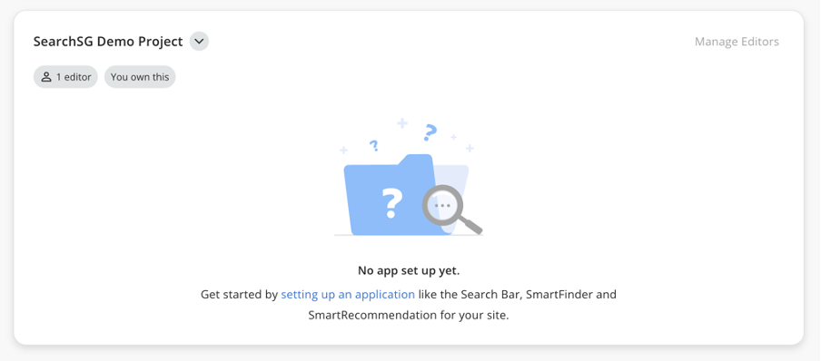
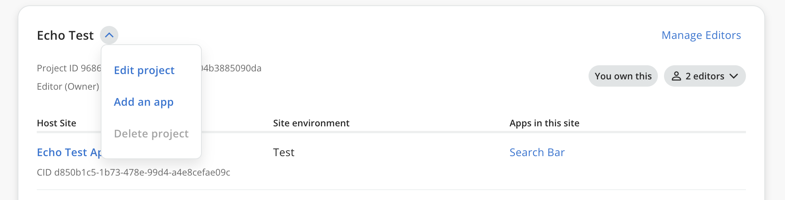
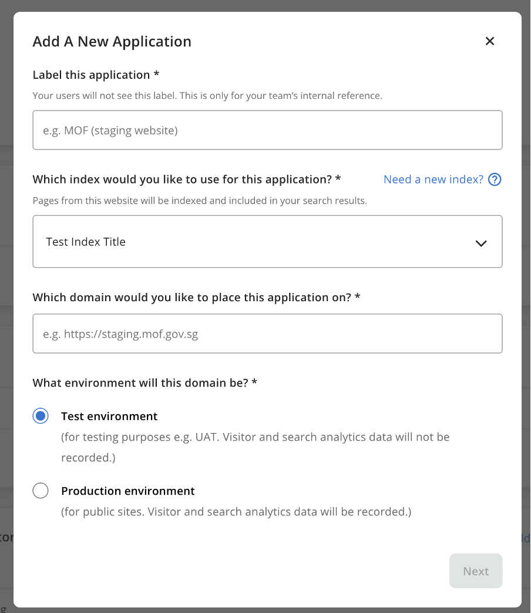
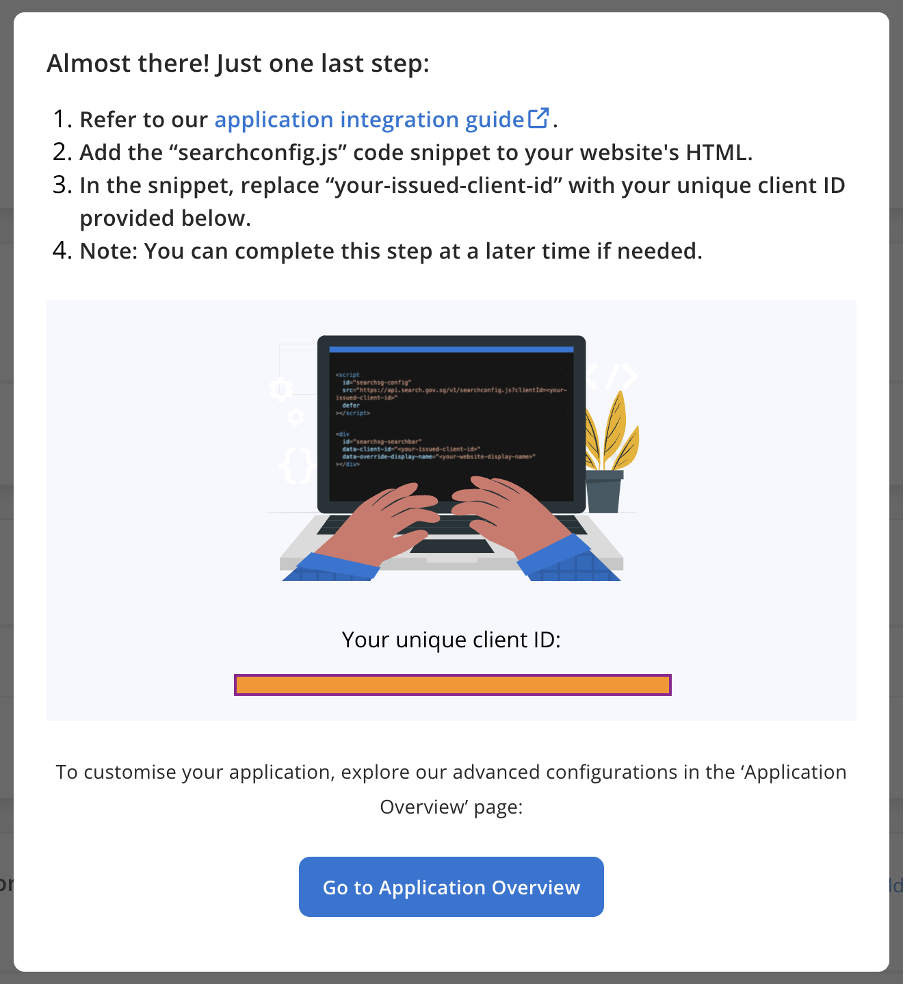
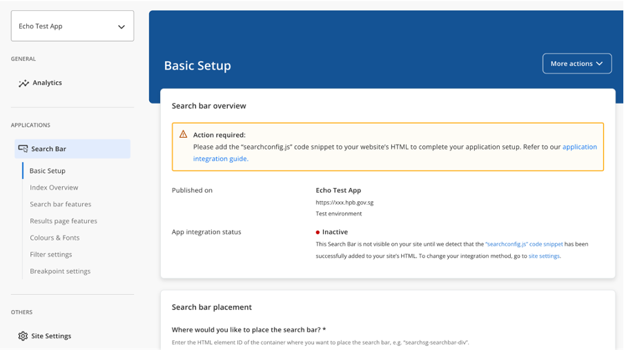

## Application

- A `Site` refers to a website or server-side application that integrates with SearchSG. 
- It serves as a workspace for multiple applications, such as Search and Recommend, requiring only a one-time integration to enable the use of multiple application features.
- An `Application` encapsulates all configurations for a specific search / recommend feature deployed on your site. E.g. search bar settings and filter configurations for your search app are managed under 'Applications'.

### How to create a Search Application?
1. Login to Admin Portal.

2. Navigate to "My Projects".

3. Locate your project.
   - If there is no existing application, click on the link "setting up an application."

   - If there are existing applications, click on the  icon and click on "Add an app".

4. Fill in your application details and select your Search Index. Click on "Next." to create. Fields with an asterisk (*) are compulsory.

5. After completing the application details, you will be shown a unique `client ID` for your application. Follow the integration guide to complete the integration with your website.

6. Click on "Go to Application Overview" to access the application setup page. The application status will initially show as "Inactive" and will change to "Active" once the integration is complete on your website.

### Configuring your Search Application
Once your search application is created, you can customise your search application under `Applications > Search Bar` section in the side menu.

#### Basic Setup
1. Search Bar Placement
    - Enter the HTML Id of the container div element where you would like the search bar component will be rendered on your website.
    - Follow the onboarding guide on how to [add the searchbar widget to your website](https://docs.developer.tech.gov.sg/docs/searchsg-onboarding-guide/getting-started?id=step-2-adding-searchbar-widget-to-your-site).

2. Search Results Page Integration
    - Control whether your would like the search results page should be embedded within your website or redirected to a seperated search results page hosted on search.gov.sg domain.
    - If you have chosen to embed the search results `within your own website`, follow the onboarding guide on how to [embed the search results page within your website search page.](https://docs.developer.tech.gov.sg/docs/searchsg-onboarding-guide/customisation-embed?id=embedded-search-results-page-experience)
