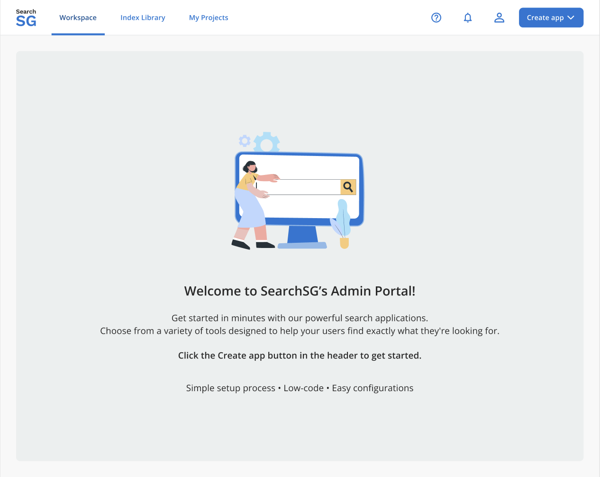
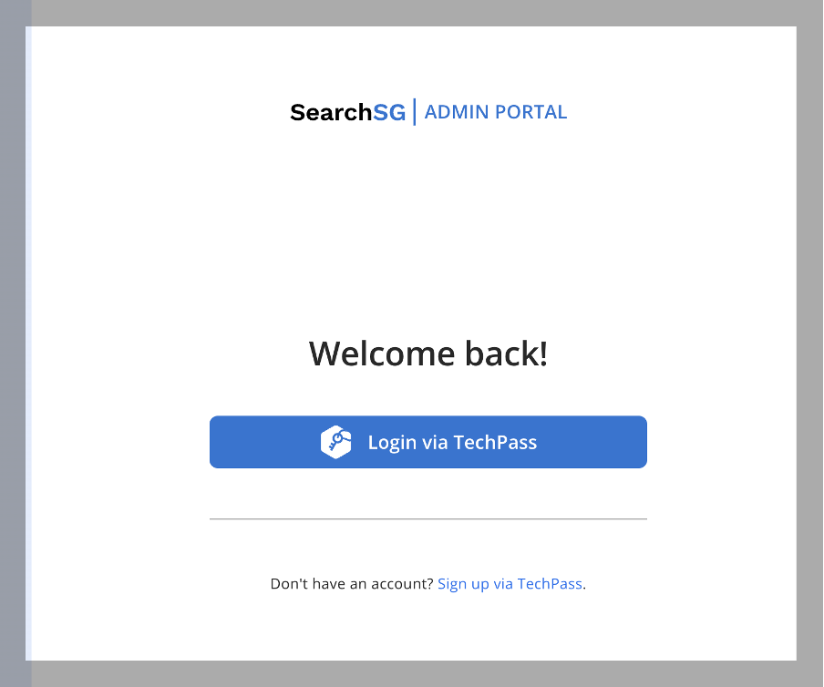
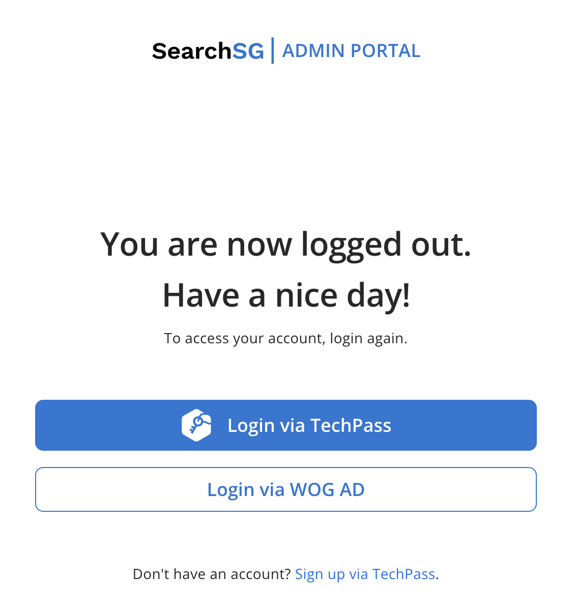

## Authentication

To login to Admin Portal, firstly you will need to onboard to [TechPass](https://docs.developer.tech.gov.sg/docs/techpass-user-guide/sign-up-and-onboard-to-techpass "TechPass Onboard Guide"). 

### How to login to Admin Portal?
1. Access the URL: [https://www.admin.search.gov.sg/](https://www.admin.search.gov.sg/)
2. Click on “Login via TechPass”
3. Follow through the TechPass authentication
4. Upon first time successfully login to Admin Portal, you will be brought to the “Workspace” page.

### How to sign up to TechPass?
1. Access the URL: [https://www.admin.search.gov.sg/](https://www.admin.search.gov.sg/)
2. Click on “Sign up via TechPass” and follow the steps.
   - Note that SEED access is **NOT** required for logging into the SearchSG Admin Portal.

### How to sign out of the Admin Portal?
1. Click on the  icon and select “Log Out”. 

2. You are expected to see the following screen after successfully logging out from the Admin Portal.

