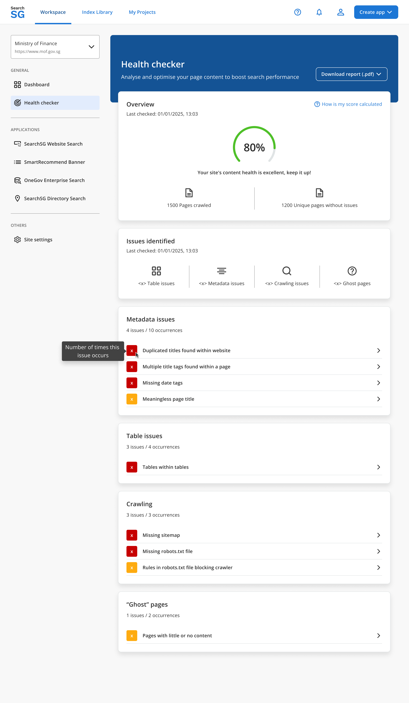

## Health Checker

The Health Checker is a tool designed to analyse and optimise your page content to boost search performance.

**Scope Note:**
- The Health Checker checks only the Public Web index created for the agency’s Website Search.
- If the agency’s Website Search is not enabled, the Health Checker will not be available.
- Even if the production environment has whole-of-government (WOG) search scope enabled, the Health Checker excludes it and focuses only on the agency search scope.

### How we analyse your content

1. **Web data source**: Provides a **complete assessment** of all content elements in each webpage.
2. **API data source**: Provides a **limited assessment**, evaluating only the data supplied via API (not the full webpage).

### How to Access the Health Checker

1. Log in to the Admin Portal.
2. Navigate to “Workspace” and select your production site from the site selection dropdown.
3. Click “Health checker”.
4. You will be redirected to the Health Checker page.

### Understanding Results

#### Health Score Formula

The Health Score is calculated as:

Health Score = (Pages without critical issues / Total pages crawled) × 100%

**Note:**
- The score is rounded to the nearest whole number.
- The score counts unique pages with issues; pages with multiple issues are only counted once.

#### Rating
- **<50%**: Critical improvements needed. Refer to this report for content enhancement recommendations.
- **50–74%**: You can do better! Keep improving your site’s content to boost search.
- **≥75%**: Your site's content health is doing great, keep it up!

#### Issue Categories

Issues are split into four categories:
1. Metadata
2. Table
3. Crawling
4. “Ghost” pages

**Note:**
- Within each category, issues are ordered by occurrence count (highest to lowest).
- If counts are the same, issues are ordered alphabetically.

#### Issue Severity Indicators
- **Critical issues (marked with a red number flag)**: Must be fixed to avoid negative impact on your content health score.
- **Potential issues (marked with a yellow number flag)**: Recommended fixes that do not impact your content health score.

### Downloading Reports

The Health Checker includes an option to download reports in PDF format so you can share them with internal and external users who do not have access to the SearchSG’s Admin Portal.

#### How to Download a Health Checker Report

1. Log in to the Admin Portal.
2. Navigate to “Workspace” and select your production site from the site selection dropdown.
3. Click “Health checker”.
4. Click the “Download report (.pdf)" button.
5. The preview of the report will be shown in a new browser tab.
6. Click the browser’s **Print** button, or use the shortcut:
    - **Edge / Chrome**: `Ctrl + P` (Windows) or `Cmd + P` (Mac).
7. Select **"Save as PDF"** as the destination, then save the report to your chosen location.

**Note:**

Reports are optimized for **A4 paper size with portrait layout**.

Ensure the option **“Background graphics”** is ticked so that different colors indicated in the report are shown correctly in the downloaded PDF. If you are unable to locate this setting, please expand **“More settings”** in the print dialog.