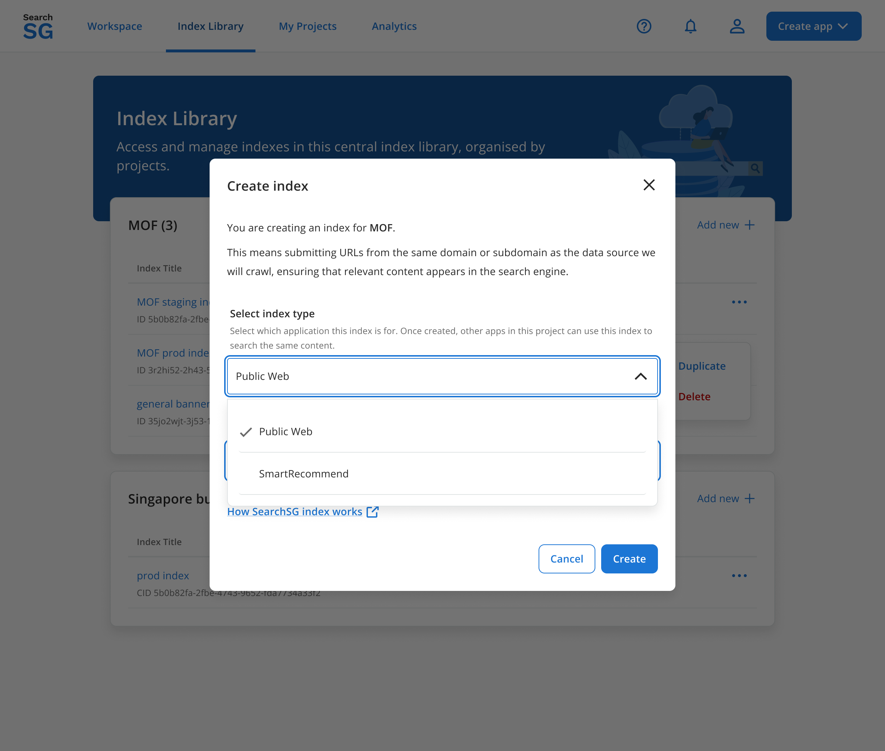
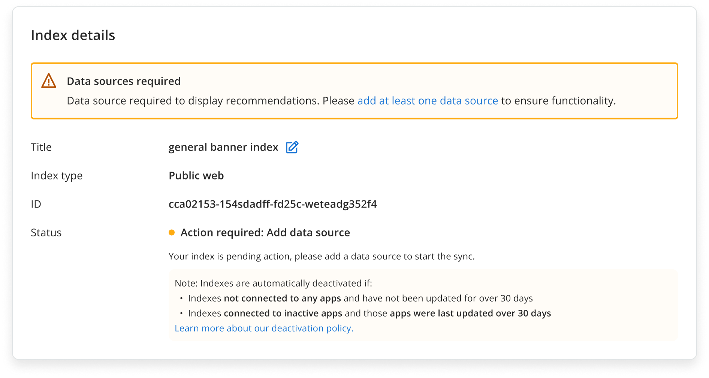
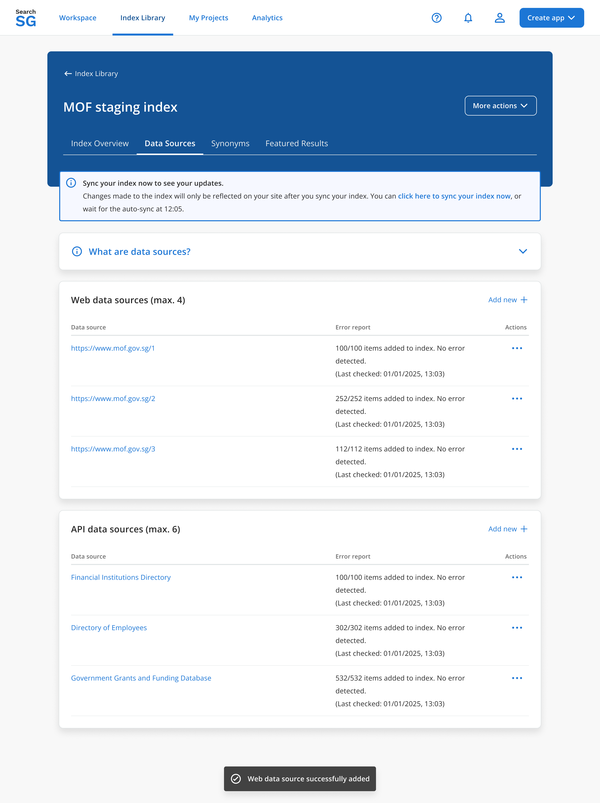
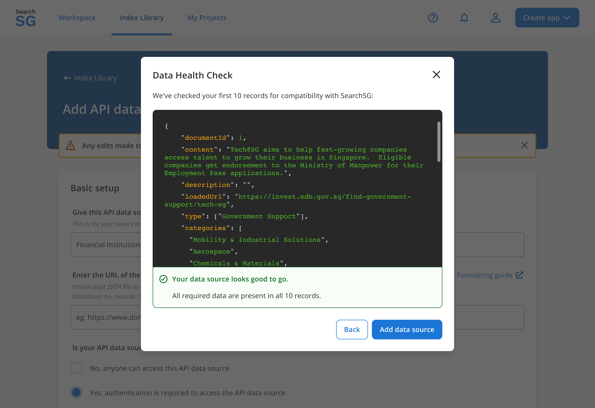
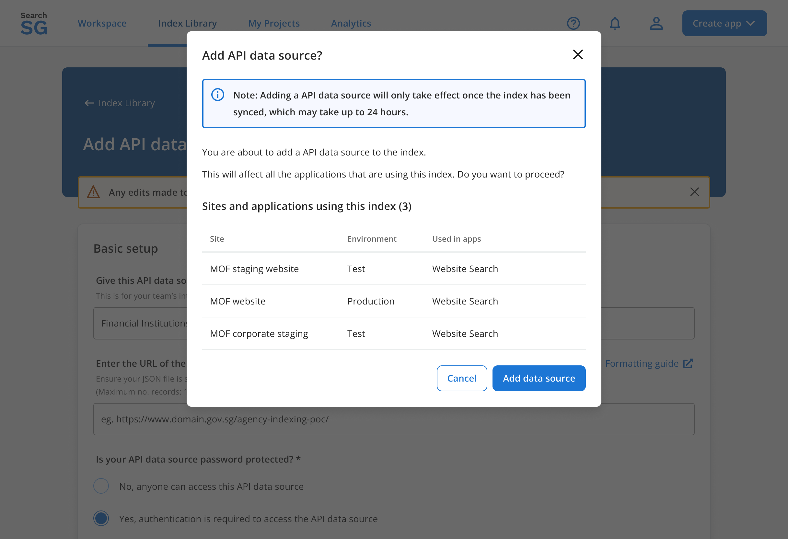
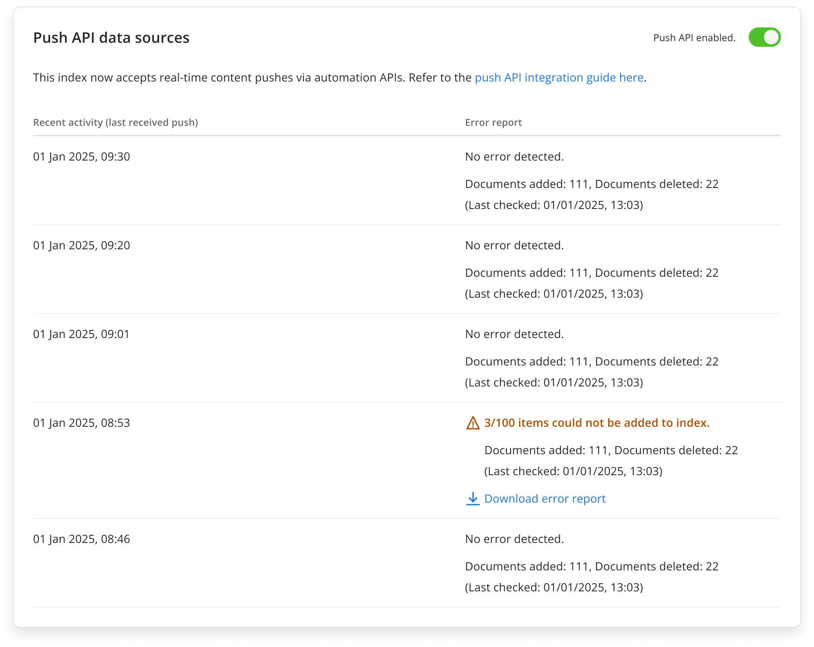
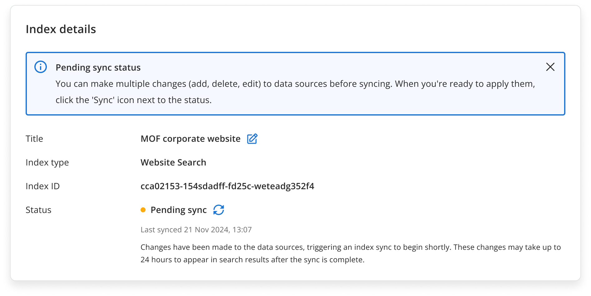
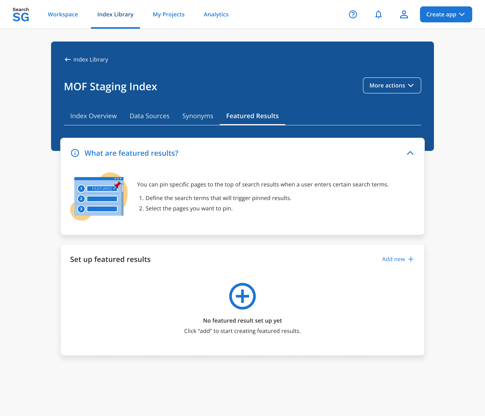
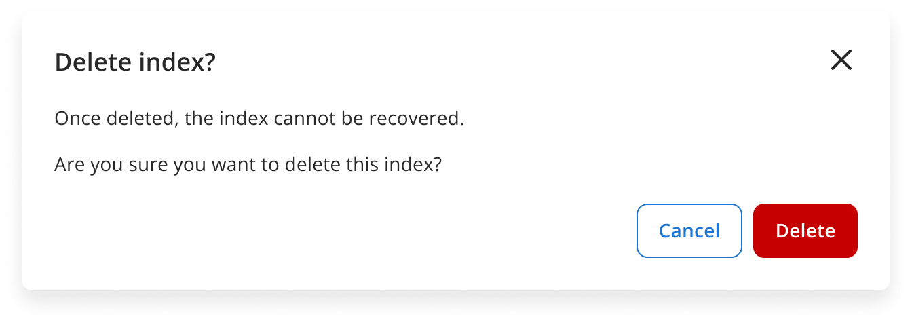

## Public Web Index

### How to Create a Search Index

#### Step 1: Access the Index Library

- Navigate to the `Index Library` page using the top navigation menu.

#### Step 2: Add a New Index

- Click on "Add new +" within the project card that you want to add your index to.
- In the pop-up window, enter a title for your index, choose `Public Web` as the type, and click “Create” to proceed.

#### Step 3: View Created Index in Index Overview

- The created index will have a status that indicates "Action Required: Add Data Source" on the Index overview page after creation.

#### Step 4: Add a Data Source

- Click on "Data sources" tab and you will be taken to the data source page.

#### Step 4.1. Setup a Web Data Source

- To add a `Web Data Source`, choose "Add new +" within Web data source card and proceed to set up the data source.

- Select your website domain to index from the list of websites crawled by SearchSG. If your domain is not listed, click on **“Domain is missing”**.
- Whitelisted and blacklisted pages are optional configuration to exclude certain webpages.
- Click on "Save" and then "Proceed" in the confirmation pop-up window.

- You will be taken back to the previous page with the newly created data source listed under the "Web data sources" section.

#### Step 4.2. Setup an API Data Source

- This API connector allows agencies to index custom API data that may be protected or not publicly available. Our API connector polls your configured endpoints hourly, to process changes in your content and updates your index automatically.
- To add an `API Data Source`, choose "Add new +" within API data source card and proceed to set up the data source.

- Fill up your API information and click on "Next". Refer our docs to understand [how API Data sources work](https://docs.developer.tech.gov.sg/docs/searchsg-onboarding-guide/indexing-features?id=b-api-data-source)

- Once configured, Data health check on your api will be performed.

    - If all required data are presented, click on "Add data source"
    - If there are missing required data, you can choose to "Fix issues" or "Continue with warnings"
    

- Click on "Add data source" in the confirmation pop-up window.

- You will be taken back to the previous page with the newly created data source listed under the "API data sources" section.

#### Step 4.3. Setup a Push API Data Source

- The `Push API Data Source` allows you to proactively send updated content and files to SearchSG whenever your data changes. With near real-time synchronization, it bypasses the need for polling, and it’s especially useful for websites with time-sensitive data.
- For enabling the `Push API Data Source`, toggle the switch button. A confirmation toast message - "Push API data source enabled" will appear upon successful activation.

- Only the latest 5 pushes within the past 7 days are displayed, including details on the number of documents added or deleted. For example, if only 1 push happened within the past 7 days, just that push will appear.
- "No error detected" indicates a successful API call.
- If errors occur, download the error report using the provided link. **Note**: Error report downloads will be available in an upcoming release.

- When disabled, previously synced content and files are preserved, so you can re-enable the data source later without data loss.

#### Step 5: Trigger Sync Process to Prepare Index

- Under "Index overview", the status of the index should be updated to "Pending Sync".

- Click on sync icon next to index status to trigger syncing process to start immediately, or wait for the scheduled job to start sync for your index automatically at a later timing.
- Once sync process is complete and your index is ready to be used, the index status will update to be "Active".

### Optional Configurations for your Search Index

#### Synonyms

1. Access Synonyms
    - Navigate to the "Synonyms" page to set up synonyms.
2. Request Synonyms setup for your Index
    - To add synonyms, reach out to us by clicking on the "Submit request form" button.
    

#### Featured Results

1. Access Featured Results
    - Navigate to the "Featured results" page to configure the featured search result.
    

2. Create Featured Results
    - Click on "Add new +" to create a new featured result set.
    - Enter details such as:
        - Search terms: Query terms that will trigger the featured result.
        - Page URLs: The URLs of webpages within your index to be pinned to the top of search results.
        
        Both fields are compulsory.
        
3. Save and Verify
    - After saving the featured results, you will return to the previous page and see the newly created featured result(s) listed under the "Set up featured results" section.
    

### How to Delete the Search Index?

***Note: Deleting a search index will remove all previous collected interaction feedback and incremental learning improvements associated with your search index, affecting search relevance.***
1. Click on "More actions" and then "Delete".

2. Click on "Delete" in the pop-up window.

3. You will be brought back to the index library page after the index is successfully removed.

    - Only indexes not used in any sites can be deleted.