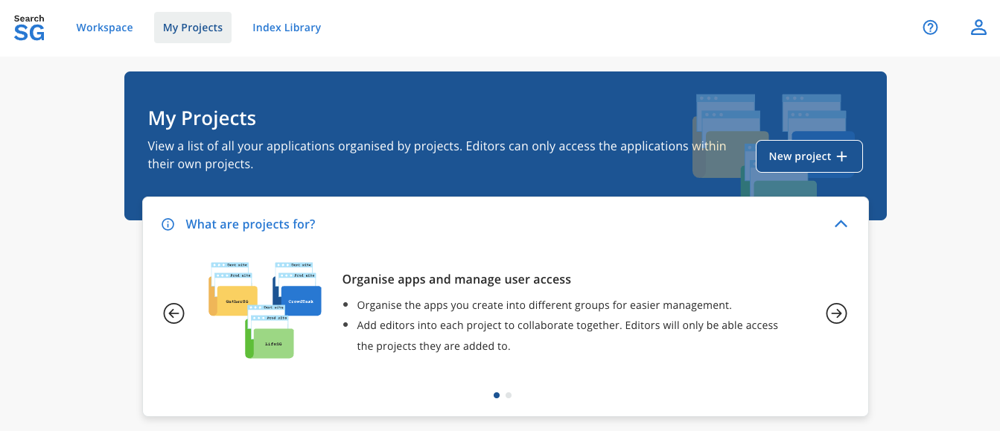
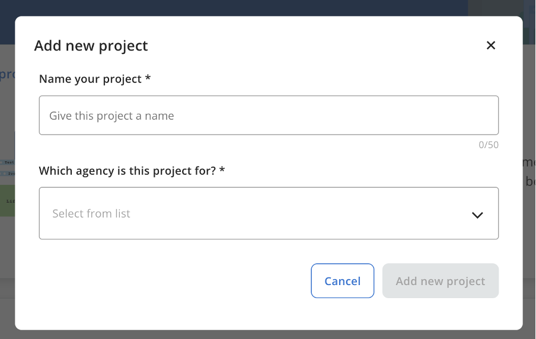
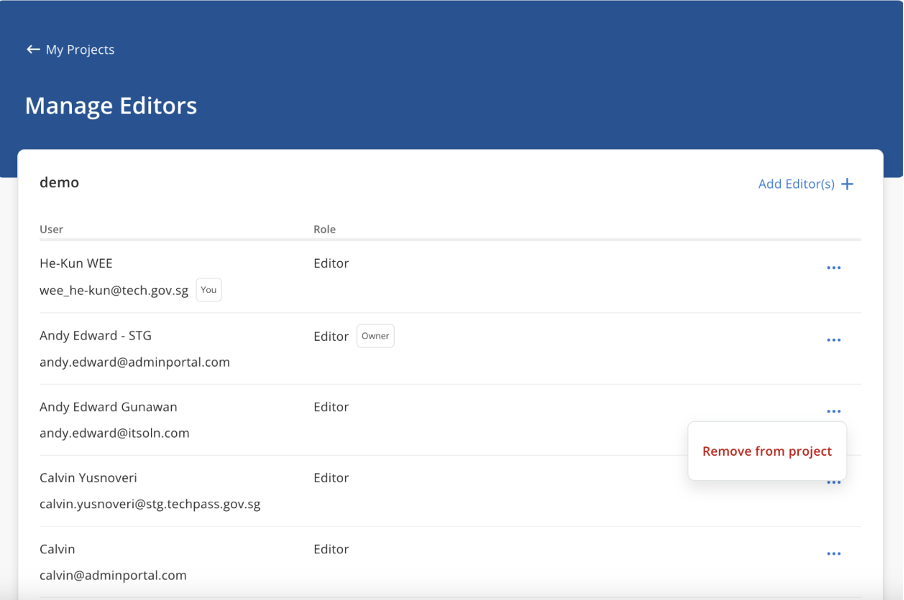
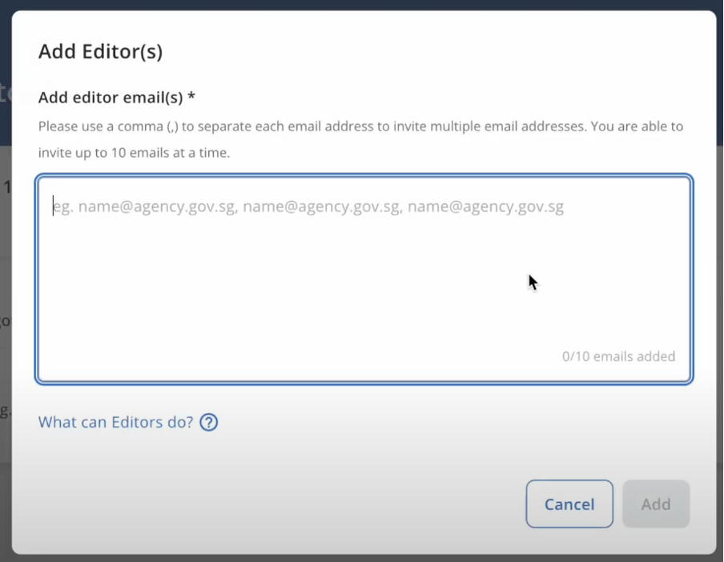
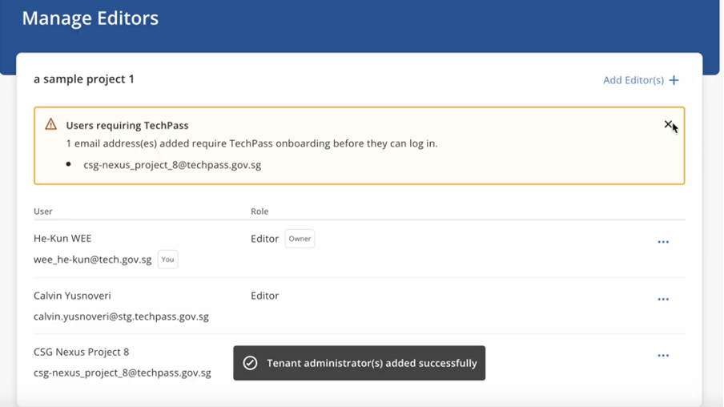
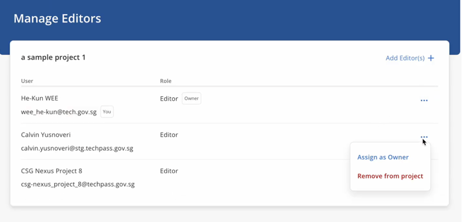
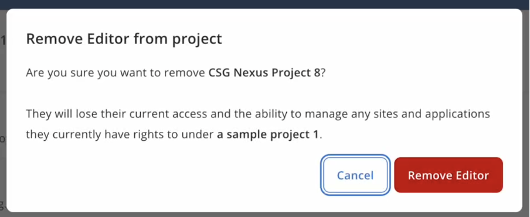
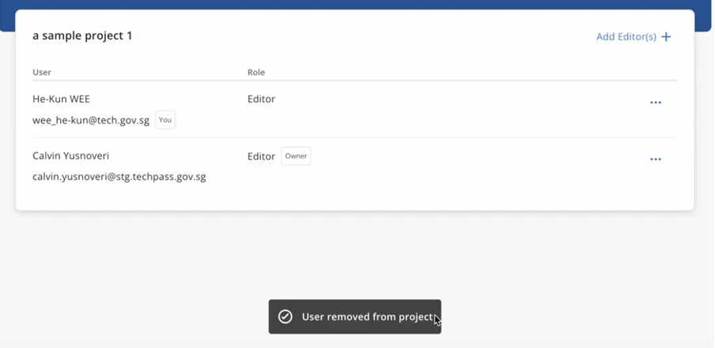
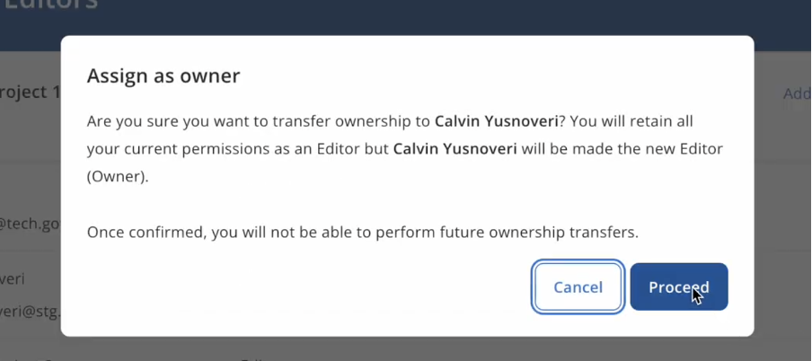
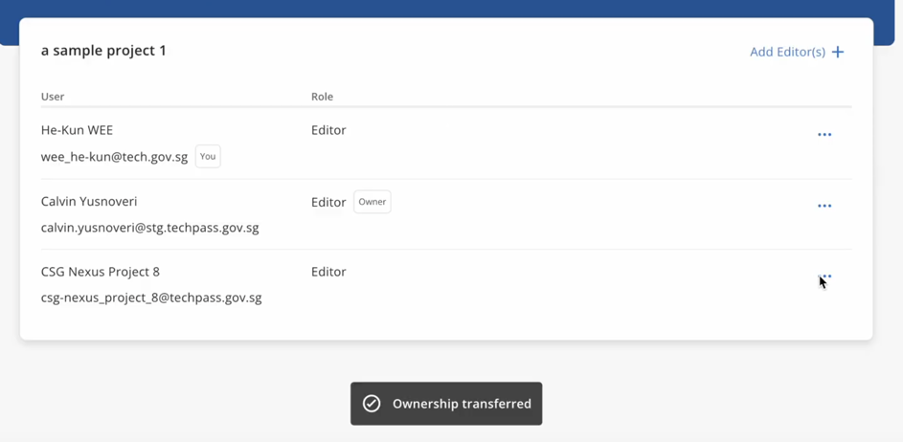

## Project

- `Projects` are designed as a subscription framework that consolidates all resources / configurations related to your tenant within a shared environment.
- Allows you to organise the apps you create into different groups for easier management.
- Add editors into each project to collaborate together. Editors will only be able access the projects they are added to.

### How to create a project?
1. Login to Admin Portal.

2. Navigate to "My Projects" and click on "New project +".

3. Fill in the project name and select your agency, then click on "Add new project".

4. You should see your project created with roles "Owner" and "Editor".

- Owner - Refers to the creator of the project. Cannot be removed by other editors on their project.
- Editor - Refers to any users that are allowed to modify users and resources associated with the project.

5. You may add or remove Editors of the project via "Manage Editors".

### How to add a new editor to the project?
1. Login to Admin Portal.

2. Navigate to "My Projects" and click on "Manage Editors".

3. You will be brought to the "Manage Editors" page, where you will see the project owner and existing editors.

4. Click on "Add Editor(s) +."

5. Enter the email address of the editor(s) and click on "Add."

6. The newly added editor(s) will appear in the list under "Manage Editors."

### How to remove the editor from the project?
1. Login to Admin Portal.

2. Navigate to "My Projects" and click on "Manage Project."

3. Click on the  icon and select "Remove from project." Note: The editor with ownership of the project cannot be removed. Transfer ownership first if necessary.

4. Click on "Remove Editor" in the pop-up window.

5. The editor will be removed from the list.

### How to transfer the ownership of the project to another editor?
1. Login to Admin Portal.
2. Navigate to "My Projects" and click on "Manage Editors."
3. Click on the  icon and select "Assign as owner." This option is only available if you are the project owner.

4. Click on "Proceed" in the pop-up window.

5. The ownership will be transferred to the new editor.

