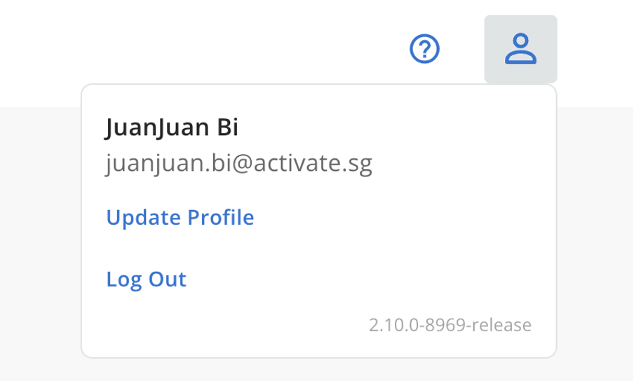
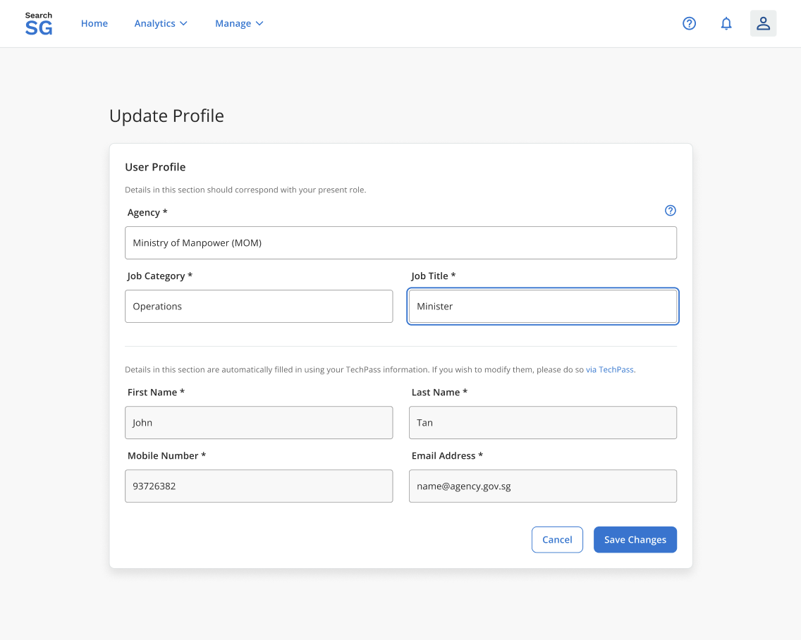

## User Profile

Your user profile contains information such as your billing agency for the resources created by you. 

The email address in your profile will be used for email notifications regarding your SearchSG resources.

### How to update your user profile?
1. Login to Admin Portal.
2. Click on the  icon then “Update profile.” 

3. Update the necessary information and click on “Save Changes”
   - **Editable Fields**: Agency, Job Category, Job Title.
   - **Non-editable Fields**: First Name, Last Name, Mobile Number, and Email Address (these fields are pulled from the TechPass portal).

   